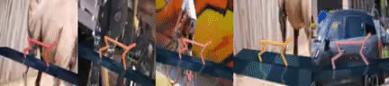
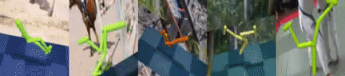

# CoRe: Contrastive Recurrent State-Space Models

This code implements the CoRe model and reproduces experimental results found in<br>
**Robust Robotic Control from Pixels using Contrastive Recurrent State-Space models**<br>
NeurIPS Deep Reinforcement Learning Workshop 2021 <br>
Nitish Srivastava, Walter Talbott, Martin Bertran Lopez, Shuangfei Zhai & Joshua M. Susskind<br>







## Requirements and Installation
Clone this repository and then execute the following steps. See `setup.sh` for an example of how to run these steps on a Ubuntu 18.04 machine. 

* Install dependencies.
    ```
    apt install -y libgl1-mesa-dev libgl1-mesa-glx libglew-dev \
            libosmesa6-dev software-properties-common net-tools unzip \
            virtualenv wget xpra xserver-xorg-dev libglfw3-dev patchelf xvfb ffmpeg
    ```
* Download the [DAVIS 2017
  dataset](https://davischallenge.org/davis2017/code.html). Make sure to select the 2017 TrainVal - Images and Annotations (480p). The training images will be used as distracting backgrounds. The `DAVIS` directory should be in the same directory as the code. Check that `ls ./DAVIS/JPEGImages/480p/...` shows 90 video directories.
* Install MuJoCo 2.1.
	- Download [MuJoCo version 2.1](https://mujoco.org/download) binaries for Linux or macOS.
	- Unzip the downloaded `mujoco210` directory into `~/.mujoco/mujoco210`.
* Install MuJoCo 2.0 (For robosuite experiments only).
	- Download [MuJoCo version 2.0](https://roboti.us/download.html) binaries for Linux or macOS.
	- Unzip the downloaded directory and move it into `~/.mujoco/`.
    - Symlink `mujoco200_linux` (or `mujoco200_macos`) to `mujoco200`.
    ```
    ln -s ~/.mujoco/mujoco200_linux ~/.mujoco/mujoco200
    ```
    - Place the [license key](https://roboti.us/license.html) at `~/.mujoco/mjkey.txt`.
    - Add the MuJoCo binaries to `LD_LIBRARY_PATH`.
    ```
    export LD_LIBRARY_PATH=$HOME/.mujoco/mujoco200/bin:$LD_LIBRARY_PATH
    ```
* Setup EGL GPU rendering (if a GPU is available).
    - To ensure that the GPU is prioritized over the CPU for EGL rendering
    ```
    cp 10_nvidia.json /usr/share/glvnd/egl_vendor.d/
    ```
    - Create a dummy nvidia directory so that mujoco_py builds the extensions needed for GPU rendering.
    ```
    mkdir -p /usr/lib/nvidia-000
    export LD_LIBRARY_PATH=$LD_LIBRARY_PATH:/usr/lib/nvidia-000
    ```
* Create a conda environment.

    For Distracting Control Suite
    ```
    conda env create -f conda_env.yml
    ```
    
    For Robosuite
    ```
    conda env create -f conda_env_robosuite.yml
    ```

## Training

* The CoRe model can be trained on the Distracting Control Suite as follows:

  ```
  conda activate core
  MUJOCO_GL=egl CUDA_VISIBLE_DEVICES=0 python train.py --config configs/dcs/core.yaml 
  ```
The training artifacts, including tensorboard logs and videos of validation rollouts will be written in `./artifacts/`.

To change the distraction setting, modify the `difficulty` parameter in `configs/dcs/core.yaml`. Possible values are `['easy', 'medium', 'hard', 'none', 'hard_bg']`.

To change the domain, modify the `domain` parameter in `configs/dcs/core.yaml`. Possible values are `['ball_in_cup', 'cartpole', 'cheetah', 'finger', 'reacher', 'walker']`.

* To train on Robosuite (Door Task, Franka Panda Arm)
  ```
  conda activate core_robosuite
  MUJOCO_GL=egl CUDA_VISIBLE_DEVICES=0 python train.py --config configs/robosuite/core_door.yaml
  ```

## License
This code is released under the [LICENSE](LICENSE) terms.
